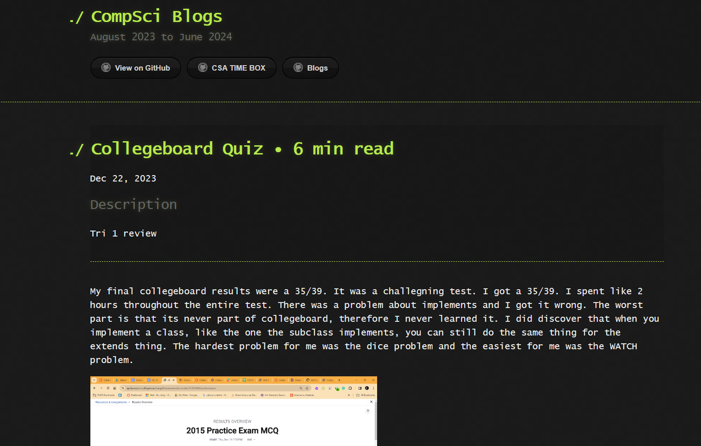

## Basic Info for overall lesson:
- Median = 0.95
### Collegeboard Quiz Prep
- I learned more about  what I did wrong as I actually spent more time on this than last time. I learned more about De Morgan's Law
- 
- [Link](https://dasmoge124.github.io/student/c3.0/c3.1/c4.1/2023/12/22/Collegeboard-quiz.html)
- In addition, I have done some ACSL contest, with some problems being similar to the collegeboard MC
## SASS
- I learned how SASS can help make websites look better and how to operate properly.
- [SASS](https://dasmoge124.github.io/student/2023/12/05/FinalSASSLesson_IPYNB_2_.html)
## JQUERY:
- The main process for CRUD is Create Read Update and Delete. This is mainly used to help manage databases.
- [Link](https://dasmoge124.github.io/student/2023/12/07/CRUD-JQUERY-HACKS_IPYNB_2_.html)
## Java Exploits:
Probably my favorite lesson. I actually review what I previously learned in the CTF Club. At that time I learned more about how SQL injections work and the applications of each SQL Injection. For example, vulnerable websites being vulnerable to pipe linux commands within their websites:
- [Link](https://dasmoge124.github.io/student/2023/12/08/JavaExploitsStudent_IPYNB_2_.html)
- Now I have learned a lot more.
## Hashmaps:
- [Hashmap_Links](https://dasmoge124.github.io/student/2023/12/13/HashmapsHashsetsCollections_IPYNB_2_.html)
### One thing I have learned is that hashmaps function similar to python arrays in terms of adding and removing, but instead of appending you use add.
- [Link](https://dasmoge124.github.io/student/2023/12/13/HashmapsHashsetsCollections_IPYNB_2_.html)
# My Issue:
- [Link to Issues](https://github.com/DasMoge124/BOBBY/issues/2)
## Key Commits to my website:

- [Tri1Commits](https://dasmoge124.github.io/student/c3.0/c3.1/c4.1/2023/11/05/Individual_Review.html)

## For the Miniproject
- Frontend

- Backend

- This was where I mainly worked on the fibonacci art piece
I have had a few issues on committing and having them commit through. But later on, I was able to put everything in an organized manner in my website. 

## Contributions to the lesson:

I did most of the grading. I mainly just made some of the popcorn hacks for the lesson.

## My Timebox:

## Something I am passionate about my project
- Something I am passionate about my project is adding sorting or searching to the java backend. I feel like that it will make the project more interesting and have a better use than the original project I did last tri.

## A Key Learning from lesson:
- A key learning for my project is essence for preventing sql injects and xxs. These right now are critical as they are possible to exoose others' public info. As a result, for the project I will research possible ways to prevent these kinds of attacks.