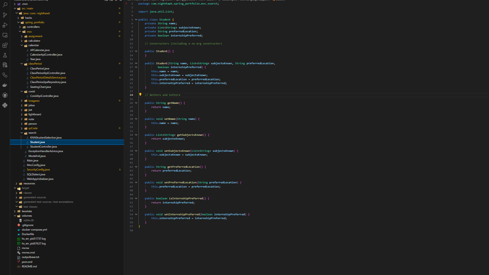
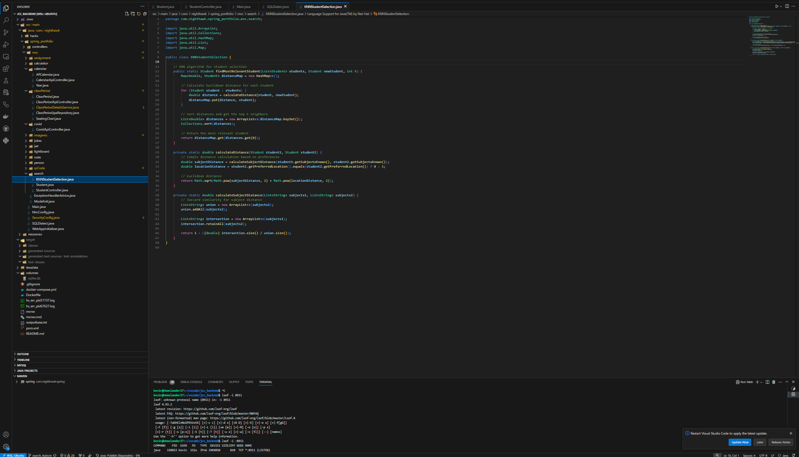
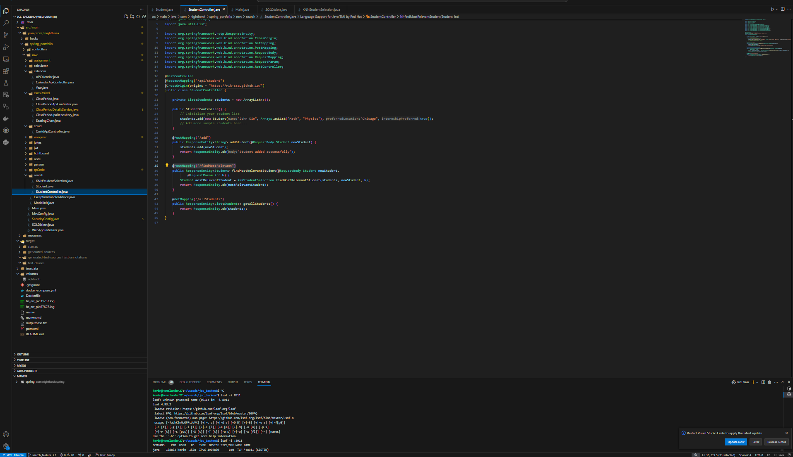
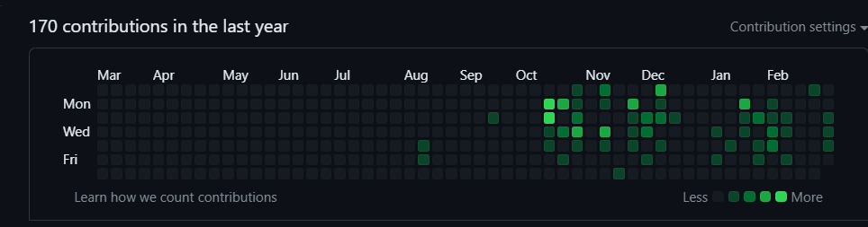

## My Contributions to Project

For the backend, I essentially made some KNN features for searching for most relevant student. Raymond technically suggested this to me so I implemented somehting similar to that:
 
 


#### Frontend:
```html
<style>
body {
    font-family: Arial, sans-serif;
    margin: 20px;
}

h1, h2 {
    margin-bottom: 10px;
}

form {
    margin-bottom: 20px;
}

label {
    display: inline-block;
    width: 150px;
    margin-bottom: 5px;
}

input[type="text"], input[type="number"] {
    width: 300px;
    padding: 5px;
}

button {
    padding: 8px 15px;
    cursor: pointer;
}
</style>
<!DOCTYPE html>
<html lang="en">
<head>
    <meta charset="UTF-8">
    <meta name="viewport" content="width=device-width, initial-scale=1.0">
    <title>Student Selection</title>
    <link rel="stylesheet" href="styles.css">
</head>
<body>
    <h1>Student Selection</h1>
    <h2>Add New Student</h2>
    <form id="addStudentForm">
        <label for="name">Name:</label>
        <input type="text" id="name" name="name" required><br><br>
        <label for="subjects">Subjects Known (comma-separated):</label>
        <input type="text" id="subjects" name="subjects" required><br><br>
        <label for="location">Preferred Location:</label>
        <input type="text" id="location" name="location" required><br><br>
        <label for="internship">Internship Preferred:</label>
        <input type="checkbox" id="internship" name="internship"><br><br>
        <button type="submit">Add Student</button>
    </form>
    <h2>Find Most Relevant Student</h2>
    <form id="findStudentForm">
        <label for="newStudent">New Student Information:</label><br>
        <input type="text" id="newStudent" name="newStudent" placeholder="Enter name, subjects, location, internship preference"><br><br>
        <label for="k">Number of Neighbors (k):</label>
        <input type="number" id="k" name="k" min="1" value="1"><br><br>
        <button type="submit">Find Most Relevant Student</button>
    </form>
    <div id="result"></div>
</body>
</html>
<script>
    document.getElementById('addStudentForm').addEventListener('submit', addStudent);
document.getElementById('findStudentForm').addEventListener('submit', findMostRelevantStudent);
function addStudent(event) {
    event.preventDefault();
    const formData = new FormData(event.target);
    const studentData = {
        name: formData.get('name'),
        subjectsKnown: formData.get('subjects').split(',').map(subject => subject.trim()),
        preferredLocation: formData.get('location'),
        internshipPreferred: formData.get('internship') === 'on'
    };
    fetch('http://localhost:4100/api/student/add', {
        method: 'POST',
        headers: {
            'Content-Type': 'application/json',
        },
        body: JSON.stringify(studentData),
    })
    .then(response => response.text())
    .then(message => alert(message))
    .catch(error => console.error('Error:', error));
}
function findMostRelevantStudent(event) {
    event.preventDefault();
    const formData = new FormData(event.target);
    const newStudentInfo = formData.get('newStudent').split(',').map(info => info.trim());
    const newStudent = {
        name: newStudentInfo[0],
        subjectsKnown: newStudentInfo[1].split(',').map(subject => subject.trim()),
        preferredLocation: newStudentInfo[2],
        internshipPreferred: newStudentInfo[3] === 'true' || newStudentInfo[3] === '1' || newStudentInfo[3] === 'on'
    };
    const k = formData.get('k');
    fetch(`http://localhost:4100/api/student/findMostRelevant?k=${k}`, {
        method: 'POST',
        headers: {
            'Content-Type': 'application/json',
        },
        body: JSON.stringify(newStudent),
    })
    .then(response => response.json())
    .then(data => {
        document.getElementById('result').innerText = `Most relevant student: ${data.name}`;
    })
    .catch(error => console.error('Error:', error));
}
</script>
```

## FRQ Contributions
[FRQ 1](https://dasmoge124.github.io/student/2024/02/19/Final_FRQ_1_IPYNB_2_.html)
[FRQ 2](https://dasmoge124.github.io/student/2024/02/19/Final_FRQ_2_IPYNB_2_.html)
[FRQ 3](https://dasmoge124.github.io/student/2024/02/19/Final_FRQ_3_IPYNB_2_.html)

## Github Analysis:

