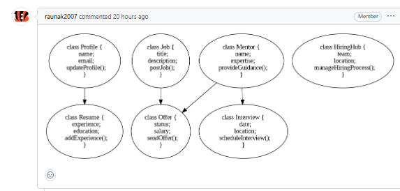
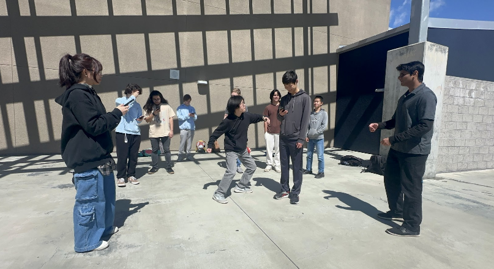
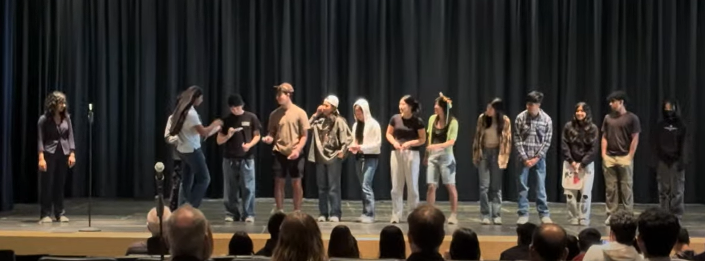
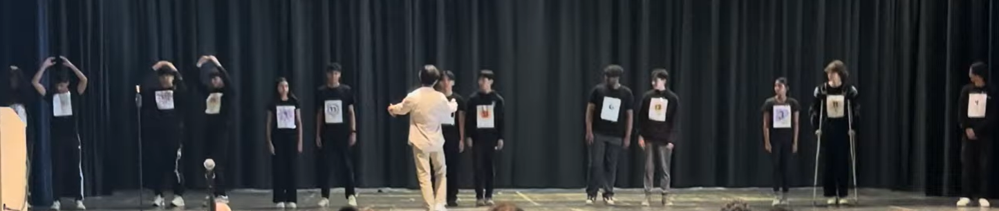
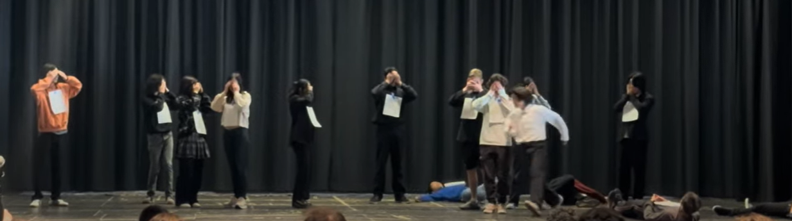

# Before

## Group Summary:
Overall, it was quite an experience. For many, it was very different from what we were used to, but we still got a lot out of it. Our understanding of sorting algorithms was enhanced and our collaboration skills fully developed, as we were able to not only coordinate rehearsal meetings but also give each other cues to act. Everyone tried hard too, as we all had our lines completely memorized (how many other teams did that?)

## During our rehearsal practice:
- This was a funny experience. I remember the time I slapped my knee during the performance. It was funny just saying "SELECTION SORT." Below are pictures of my performance

## During our performance
I've learned quite a lot about the different kinds of sorting. I learned stuff like merge sort just spliting in half and then sorting then combine and sort then so on and bubble sort is consecutively comparing until everything is sorted. Rachit's team's performance was a really fun experience considering how he is dressed up as "Rachetlina" or something and they used sorting to find the best "match." When Theo carried Rachit, I was laughing inside.

- The flowers skit lol. "FLOWERS. FLOWERS. FLOWERS":

And there is us:

